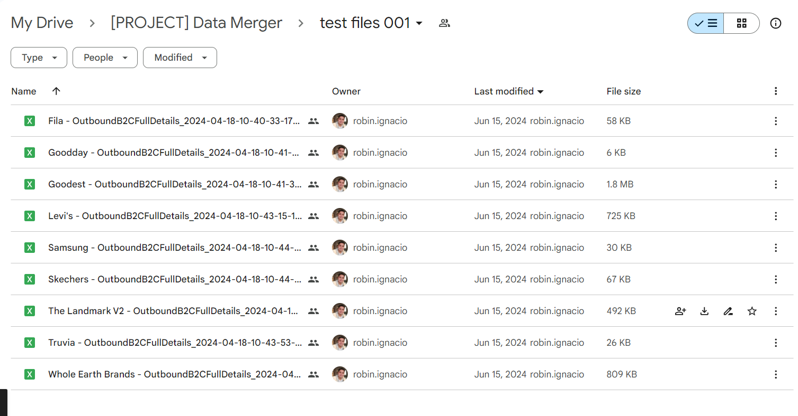
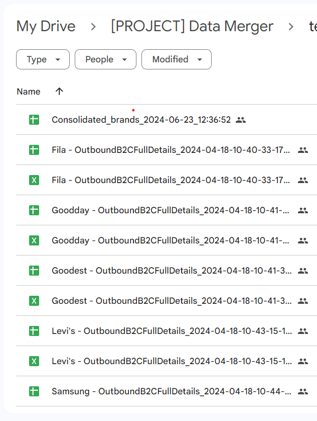
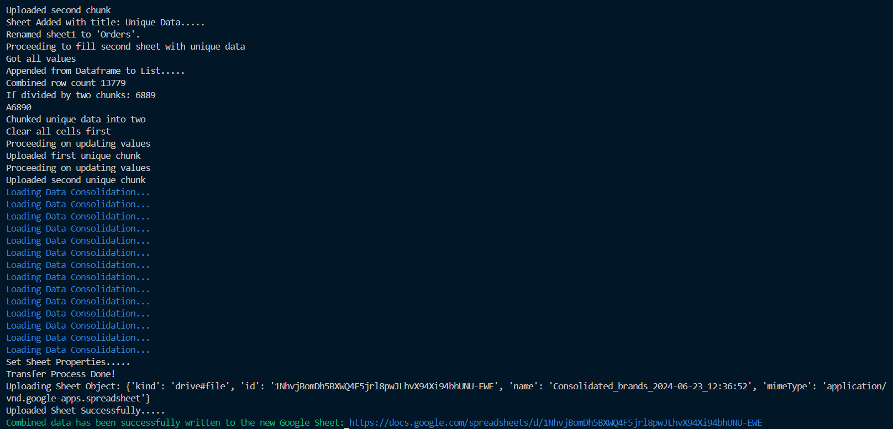

# Google Sheet Data Merger

## Description
This project is part of an ETL process for brand files in Locad platform. Initially, files are in an excel format and then converted to Google sheet for consolidation.

## Requirements
You need a Google API Service account to be added as an editor in the drive folder.
1. Service account Key inside the main/config.py

Also note the dependencies needed, already at the **requirements.txt**:
1. Gspread version 5.7.2
2. Latest pandas
3. google-api-python-client version 2.134.0
4. oauth2client 4.1.3

## Installation Steps
Follow these steps to set up and run the merger:

1. **Clone Repository:**
   - Clone this repository to your local machine.

     ```bash
     git clone https://github.com/greatdecipher/data_merger.git
     ```

2. **Create Virtual Environment:**
   - Navigate to the 'main' folder and create a virtual environment.

     ```bash
     cd data_merger
     python -m venv venv
     ```

3. **Install Requirements:**
   - Install the required packages using pip.

     ```bash
     cd main/
     pip install -r requirements.txt
     ```

4. **Run the Scraper:**
   - Execute the scraper script.

     ```bash
     python -m main
     ```

## Logging
Logging is implemented on running the scraper, please see bash to trace scraper running in headless mode.

## Cloud Platforms
- This script is running in Google Colab environment for production use only. Might need to install different version of dependencies.

## Project Demo
- Please watch this recorded demo of the merger in LOOM: 
    https://www.loom.com/share/abff80674d464b609cabaad5d1f8e994?sid=0cfdadd7-e7fd-480c-97fe-e8f68baa0004

## Screenshots/Results

1. Google Folder (Before consolidation)
   

2. Google Folder (After Consolidation)
   

3. Local Run
   


## Notes
- Ensure you have Python 3.12 installed on your machine before proceeding with the installation steps.

